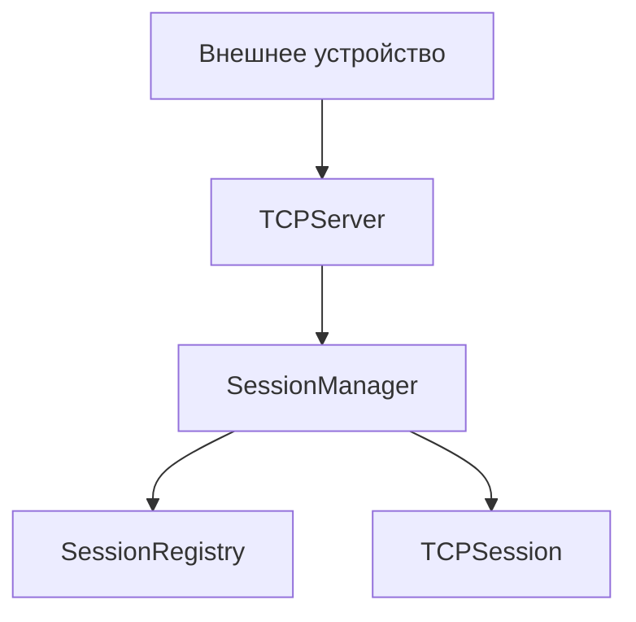
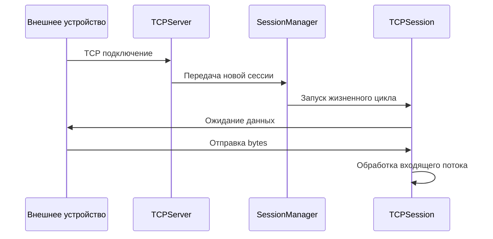
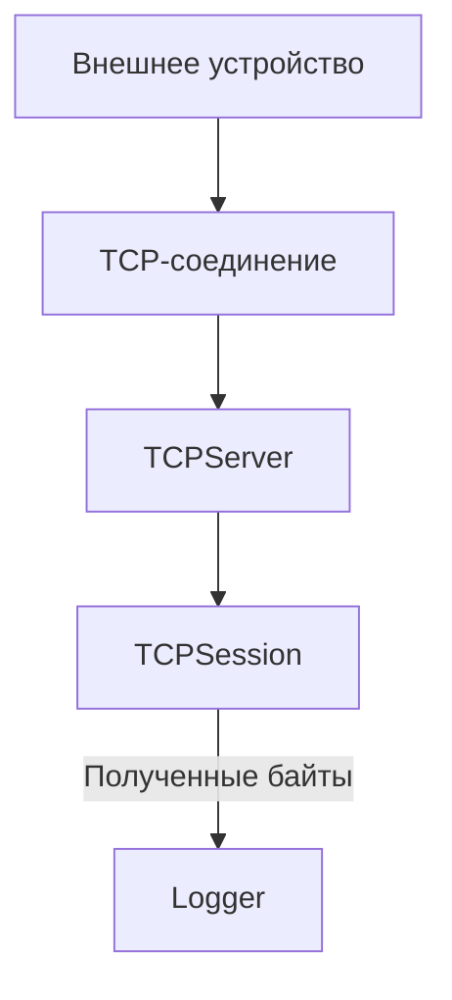
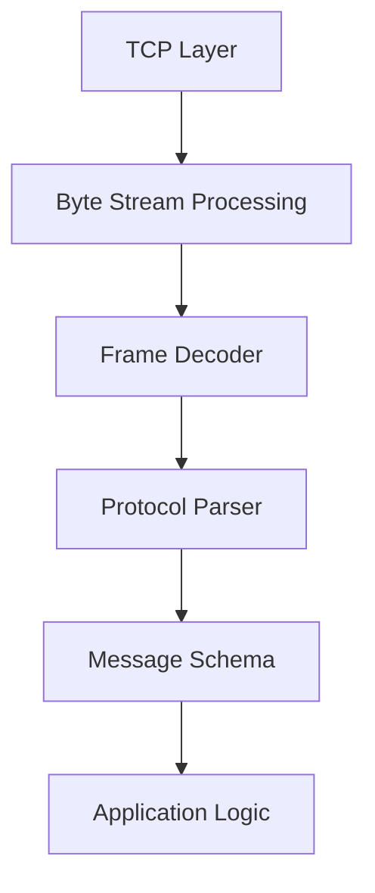

# TCP Server

## Обзор

В текущей версии Happy Laba реализован асинхронный TCP-сервер на базе asyncio.

Сервер представляет собой транспортный слой для интеграции с лабораторным оборудованием и отвечает за установление соединений, управление сессиями и прием входящих данных.

На текущем этапе сервер выполняет только транспортную обработку данных. Полученные сообщения не проходят через протокол обработки и выводятся в лог приложения.

---

# Архитектура текущей реализации



---

# Компоненты

## TCPServer

Расположение:
core/infrastructure/network/tcp/server.py

TCPServer отвечает за управление TCP-соединениями.

Основные задачи:

- запуск TCP listener;
- прием входящих подключений;
- создание клиентских сессий;
- передача сессий в SessionManager;
- корректная остановка сервера.

TCPServer не отвечает за обработку содержимого сообщений.

---

## TCPSession

Расположение:
core/infrastructure/network/tcp/session.py

Каждое активное подключение представлено отдельным объектом TCPSession.

Ответственность:

- чтение данных из TCP-потока;
- контроль состояния соединения;
- обработка отключения удаленной стороны;
- освобождение сетевых ресурсов.

Каждая сессия работает независимо от остальных подключений.

---

## SessionManager

Расположение:
core/application/sessions/session_manager.py

SessionManager управляет жизненным циклом активных TCP-сессий.

Ответственность:

- прием новых сессий;
- запуск обработки подключений;
- хранение задач сессий;
- корректное завершение работы активных соединений.

---

## SessionRegistry

Расположение:
core/application/sessions/session_registry.py

SessionRegistry используется для хранения активных подключений.

Ответственность:

- регистрация новых сессий;
- удаление завершенных сессий;
- получение списка активных подключений.

---

# Поток обработки подключения


---

# Получение данных

В текущей реализации входящие данные проходят следующий путь:


После получения данных TCPSession считывает байты из TCP-потока и выводит их в лог приложения.

Пример:
```text
2026-07-08 12:00:00 | WARNING |b'example message bytes'
```
---

# Ограничения текущей версии

На данный момент отсутствуют:

- обработка конкретных лабораторных протоколов;
- разбор входящих сообщений;
- преобразование bytes в структурированные данные;
- сохранение полученной информации;
- отправка ответных сообщений устройству.

Текущая версия предоставляет стабильный TCP-транспорт, который является основой для дальнейшей реализации протокольного слоя.

---

# Запуск

## Docker

Сборка контейнера:
docker compose build

Запуск:
docker compose up

---

## Локальный запуск

Установка зависимостей:
uv sync

Запуск приложения:
python main.py

---

# Проверка подключения

Для проверки работы сервера можно использовать любой TCP-клиент.

Например:
nc localhost 8000

После отправки данных они будут отображены в логах приложения.

---

# Конфигурация

Параметры TCP-сервера задаются через конфигурацию приложения.

Основные параметры:

| Параметр | Описание |
|----------|----------|
| host | адрес прослушивания TCP-сервера |
| port | порт TCP-сервера |
| read_size | размер блока чтения из TCP-потока |

Пример конфигурации:
```
TCP_HOST=0.0.0.0
TCP_PORT=8000
TCP_READ_SIZE=1024
```

---

# Дальнейшее развитие



Протокольная обработка будет реализована отдельно от TCP-инфраструктуры, что позволит добавлять поддержку различных лабораторных устройств без изменения транспортного слоя.