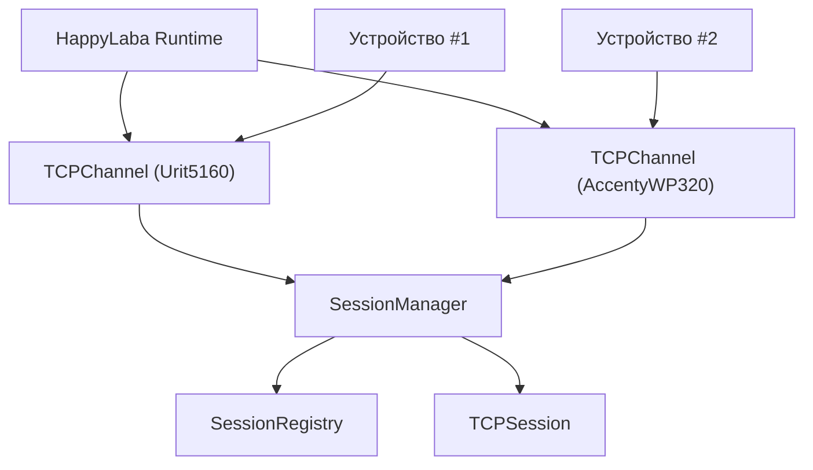
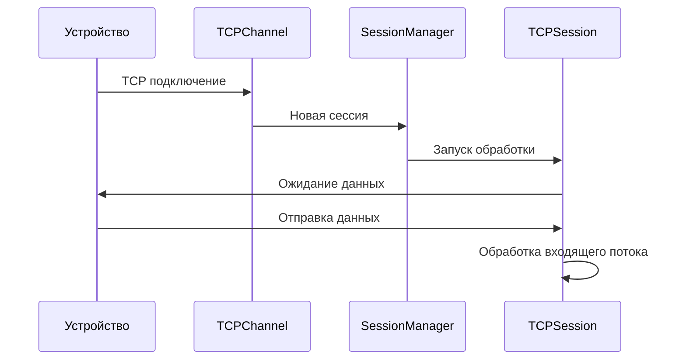
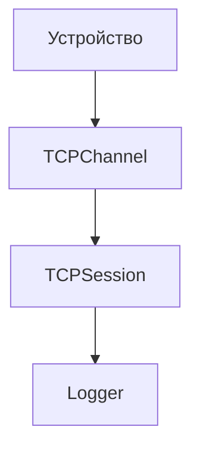

# TCP Channels

## Обзор

Начиная с версии 0.0.3 Happy Laba поддерживает работу с несколькими независимыми TCP-каналами в рамках одного экземпляра приложения.

Каждый TCP-канал соответствует отдельному типу лабораторного оборудования и имеет собственную конфигурацию, включающую:

- тип устройства;
- адрес прослушивания;
- TCP-порт;
- параметры создаваемых сессий.

Жизненным циклом всех каналов управляет Runtime приложения.

Полученные сообщения пока проходят только транспортную обработку и выводятся в журнал приложения.

---

# Архитектура

---

# Компоненты

## HappyLaba

Расположение:
runtime/happy_laba.py

Управляет жизненным циклом приложения.

Ответственность:

- создание TCP-каналов;
- запуск каналов;
- мониторинг их состояния;
- автоматический перезапуск завершившихся каналов;
- корректное завершение приложения.

---

## TCPChannel

Расположение:
core/infrastructure/network/tcp/server.py

Каждый экземпляр TCPChannel обслуживает один TCP-порт и один тип устройства.

Ответственность:

- запуск TCP listener;
- прием входящих подключений;
- создание TCP-сессий;
- передача новых сессий в SessionManager;
- корректная остановка канала.

TCPChannel не занимается обработкой содержимого сообщений.

---

## TCPSession

Расположение:
core/infrastructure/network/tcp/session.py

Каждое TCP-подключение представлено отдельным объектом TCPSession.

Ответственность:

- чтение данных;
- запись данных;
- управление состоянием соединения;
- освобождение сетевых ресурсов.

---

## SessionManager

Расположение:
core/application/sessions/session_manager.py

SessionManager управляет жизненным циклом всех активных TCP-сессий.

Ответственность:

- регистрация новых сессий;
- запуск обработки соединений;
- завершение сессий выбранного TCP-канала;
- координация работы SessionRegistry.

---

## SessionRegistry

Расположение:
core/application/sessions/session_registry.py

Хранит информацию обо всех активных сессиях приложения.

Ответственность:

- регистрация сессий;
- удаление завершенных сессий;
- получение списка активных соединений.

---

# Поток обработки подключения

---

# Получение данных

Входящие данные проходят следующий путь:

После получения данных TCPSession считывает байты из TCP-потока, собирает MLLP-сообщения и выводит их в журнал приложения.

---

# Конфигурация

Каждый TCP-канал описывается отдельной записью в YAML-конфигурации.

Пример:
```yaml
devices_config:

  - device_type: Urit5160 
    device_channel:
      host: 0.0.0.0
      port: 8000
    device_session:
      read_size: 4096

  - device_type: AccentyM320 
    device_channel:
      host: 0.0.0.0
      port: 8001
    device_session:
      read_size: 4096

  - device_type: SematySMT120 
    device_channel:
      host: 0.0.0.0
      port: 8002
    device_session:
      read_size: 4096
```

При запуске приложения автоматически выполняются проверки:

- корректности конфигурации;
- уникальности TCP-портов;
- доступности портов для прослушивания.

---

# Ограничения текущей версии

На данный момент отсутствуют:

- маршрутизация сообщений по обработчикам;
- разбор HL7-сообщений;
- преобразование сообщений в доменные объекты;
- сохранение результатов;